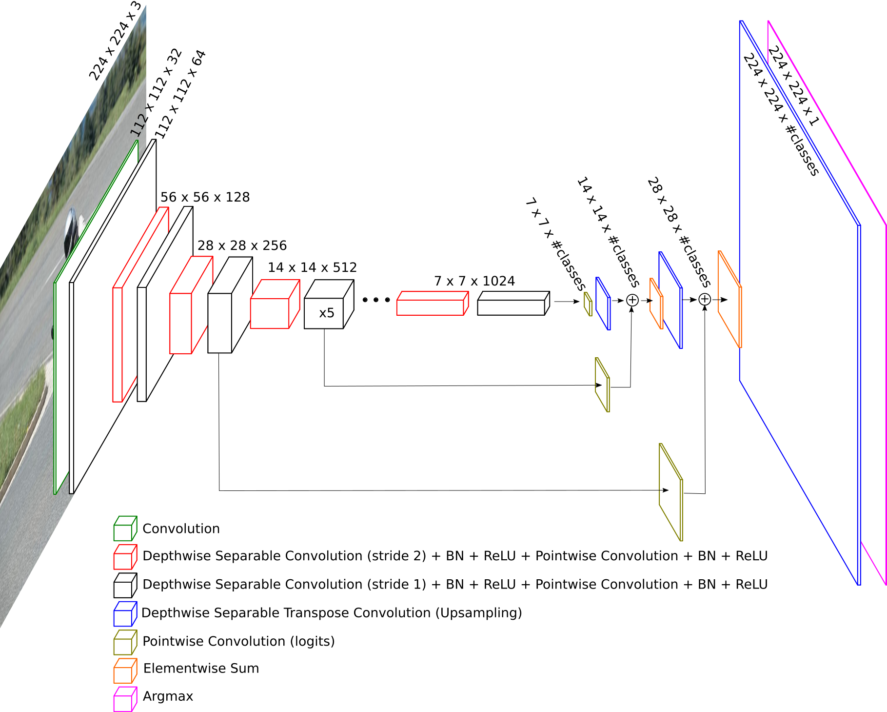
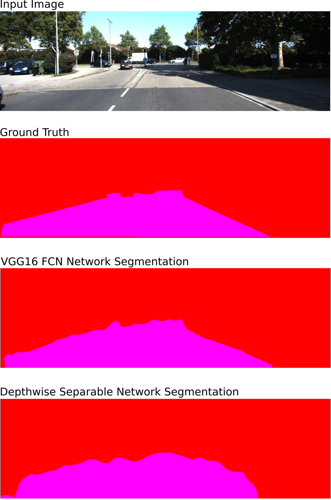
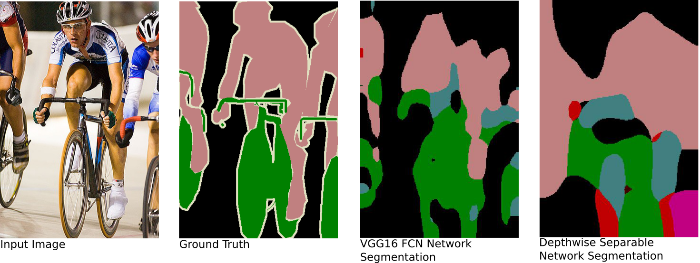

# mobile-fcn
An experiment looking into the extent to which the speed of the FCN model for semantic segmentation can be improved by reducing the number of computations in the encoder network.

The model tested is based on [Fully Convolutional Networks for Semantic Segmentation](https://people.eecs.berkeley.edu/~jonlong/long_shelhamer_fcn.pdf). This network is tested with both a VGG16 encoder (as suggested in the original paper), and with an encoder adapted from [MobileNets: Efficient Convolutional Neural Networks for Mobile Vision Applications](https://arxiv.org/abs/1704.04861). The MobileNet encoder is a lightweight architecture that benefits from using depthwise separable convolutions.

## Architecture
The mobile-fcn architecture is illustrated below:

## Test Results
### KITTI Road Segmentation
Sample image segmentation:

Results:

| Model | Test Mean IoU | Mean Prediction Time | Checkpoint Size |
| ----- | ------------- | -------------------- | --------------- |
| VGG16 FCN Network | 93.5% | 400.7 msecs | 512 MB |
| mobile-fcn | 88.76% | 48.6 msecs | 12.3 MB |

### Pascal VOC 2012
Sample image segmentation:

Results:

| Model | Test Mean IoU | Mean Prediction Time | Checkpoint Size |
| ----- | ------------- | -------------------- | --------------- |
| VGG16 FCN Network | 51.51% | 134.3 msecs | 513 MB |
| mobile-fcn | 16.90% | 19.0 msecs | 12.5 MB |

## Conclusion
The mobile-fcn architecture achieves approximately 7-times speedup (for ~20 classes) over the FCN architecture with the VGG16 decoder, but it undoubtedly performs worse on the semantic segmentation task. On the challenging Pascal VOC 2012 dataset, the mobile-fcn model performs drastically worse than the original FCN network. On the simpler 2-class Kitti dataset, the accuracy drop is smaller and such a trade-off may be desirable for specific applications.
